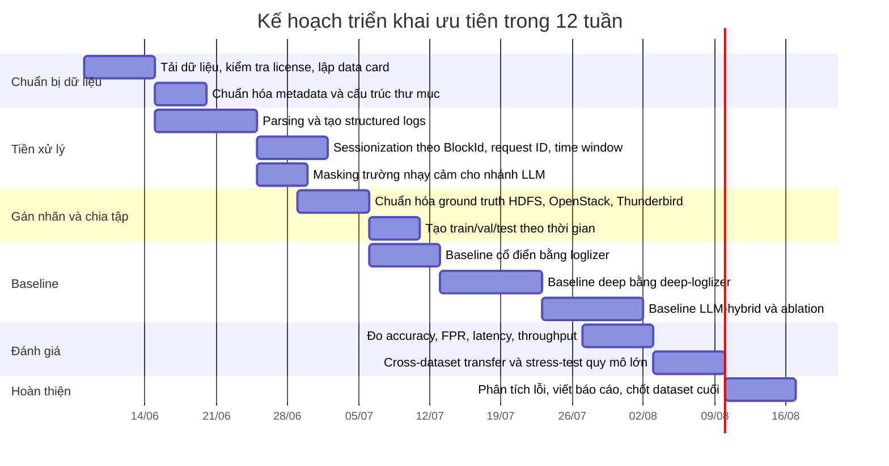

Về acquisition, nên tải toàn bộ từ nguồn chính thức và lập **data card** cho từng bộ ngay từ đầu, gồm phiên bản, license, số file, checksum, dung lượng, field mapping và cách dẫn nguồn. Với LogHub, README cho biết raw logs tải qua hyperlink ở cột Download, và license yêu cầu dẫn repo/paper; với CSE-CIC-IDS2018, trang chính thức dùng AWS open data / S3.

Về preprocessing, pipeline nên thống nhất theo ba tầng. Tầng đầu là **parsing**: dùng **logparser** hoặc **Drain/Drain3** để chuyển log thô thành template và structured fields. Tầng hai là **sessionization / correlation**: HDFS_v1 group theo **BlockId**; OpenStack group theo **request/context IDs** hoặc service-log windows; Thunderbird/BGL group theo **node/location/time window**. Tầng ba là **featureing**: song song tạo (a) histogram/Event occurrence matrix cho baseline cổ điển theo loglizer, (b) sequence tensors cho DeepLog/Transformer theo deep-loglizer, và (c) context snippets ngắn gọn cho nhánh LLM.

Về labeling, HDFS_v1, BGL, Thunderbird đã có ground truth tương đối rõ theo đúng kiểu benchmark của chúng. Với OpenStack, do README không mô tả nhãn chi tiết ở mức dòng/request, nên bạn nên chuẩn hóa nhãn theo **case**, rồi dựng các **window labels** nhất quán cho benchmarking. Với dữ liệu riêng của dự án sau này, nên áp dụng chiến lược **weak supervision**: ghép ticket/alert/incident timeline, rule-based heuristics, rồi mới dùng LLM để **triage và giải thích**, không dùng LLM làm nhãn vàng duy nhất.

Về baseline experiments, nên chạy theo ba lớp. Lớp đầu là **classical log anomaly detection** với PCA, Isolation Forest, Invariants Mining, Clustering và một supervised baseline đơn giản trên HDFS_v1/OpenStack. Lớp hai là **sequential deep models** như DeepLog, LogAnomaly, LSTM, Transformer và Autoencoder. Lớp ba là **LLM-hybrid**: không feed toàn bộ raw log trực tiếp, mà feed **template sequence + key fields + retrieval context**, rồi đo xem LLM có giúp giảm false positives hay cải thiện explanation/triage hay không. Đây là cách hợp lý hơn nhiều so với dùng raw log trực tiếp khi đề tài đồng thời quan tâm tới **response time**.

Một khuyến nghị rất thực dụng là chia evaluation thành hai câu hỏi riêng. Câu hỏi một: **phát hiện bất thường có chính xác không?** — đo bằng Precision, Recall, F1, ROC-AUC hoặc PR-AUC, đặc biệt là **false positive rate**. Câu hỏi hai: **giải pháp có vận hành được không?** — đo bằng **thời gian parsing**, **thời gian inference**, throughput theo dòng log/giây, và footprint bộ nhớ trên bộ Thunderbird/BGL lớn. Như vậy bạn sẽ bám sát đúng tiêu chí đề tài thay vì chỉ tối ưu một chỉ số học máy.

Nếu cần một kế hoạch ngắn gọn hơn để bắt tay ngay, thứ tự nên là: **OpenStack trước**, **HDFS_v1 song song**, rồi **Thunderbird/BGL** sau cùng. OpenStack giúp bạn chứng minh phù hợp miền ứng dụng; HDFS_v1 giúp bạn có kết quả benchmark sớm và sạch; Thunderbird/BGL giúp bạn trả lời câu hỏi về quy mô, drift và false positives; HDFS_v3 hoặc CSE-CIC-IDS2018 chỉ nên thêm vào khi hai bộ đầu đã ổn.
