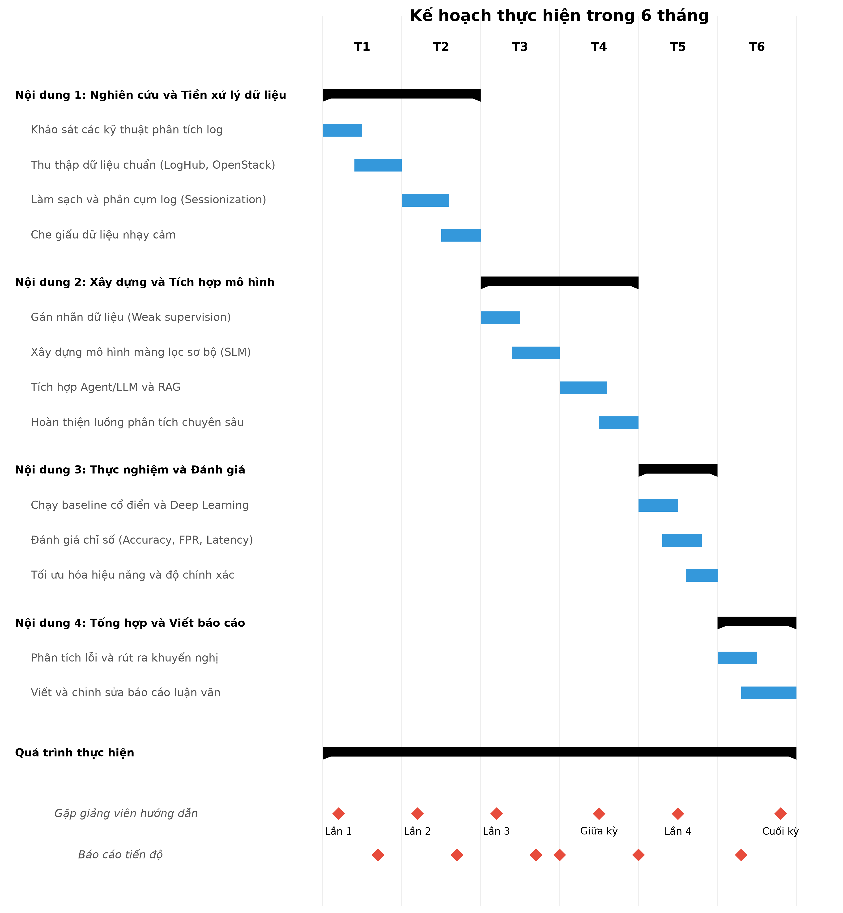

# ĐỀ CƯƠNG ĐỀ TÀI LUẬN VĂN THẠC SĨ

**Tên đề tài:** Phát hiện sự cố bất thường trong hệ thống mạng lớn sử dụng phân tích dữ liệu nhật kí dựa trên trí tuệ nhân tạo

## 1. Nội dung

**Giới thiệu về đề tài:**
- **Bài toán/Vấn đề:** Các hệ thống mạng lớn sinh ra khối lượng dữ liệu nhật kí (log) khổng lồ, khiến các kỹ thuật giám sát truyền thống trở nên quá tải, kém hiệu quả và mang tính thụ động. Bên cạnh đó, sự gia tăng của các cuộc tấn công mạng sử dụng AI đòi hỏi một cơ chế phát hiện tự động, chủ động và chính xác hơn.
- **Input:** Dữ liệu nhật kí (Application, System, Security, Network logs) dạng thô.
- **Output:** Các cảnh báo sự cố bất thường, phân tích nguyên nhân gốc rễ và đề xuất biện pháp xử lý.
- **Lí do chọn đề tài & Tính thời sự:** Việc phát hiện sớm và tự động các bất thường là yêu cầu sống còn đối với an toàn thông tin hiện đại. Việc ứng dụng kết hợp Mô hình ngôn ngữ lớn (LLM) mã nguồn mở và học máy (Machine Learning) đang là xu hướng đột phá giúp giải quyết các hạn chế của phân tích cú pháp (parsing) tĩnh, từ đó cải thiện tính minh bạch và độ chính xác.
- **Khả năng ứng dụng:** Triển khai trên các hệ thống giám sát thực tế của doanh nghiệp, giúp tối ưu chi phí vận hành và tự động hóa quy trình phân tích của quản trị viên.

**Mục tiêu của đề tài:**
1. Đề xuất kiến trúc xử lý, sàng lọc và trích xuất đặc trưng hiệu quả đối với khối lượng dữ liệu nhật ký đa dạng và khổng lồ.
2. Xây dựng và đánh giá giải pháp phát hiện bất thường kết hợp Mô hình ngôn ngữ lớn (LLMs mã nguồn mở) nhằm tối ưu độ chính xác, tỷ lệ dương tính giả và tốc độ phản hồi.
3. Tích hợp giải pháp thành một quy trình giám sát chủ động (end-to-end), có khả năng triển khai thực nghiệm trên môi trường hệ thống mạng quy mô vừa và nhỏ.

**Nội dung nghiên cứu của đề tài:**
1. **Nghiên cứu cơ sở lý thuyết:** Khảo sát các loại dữ liệu nhật ký, các mô hình tấn công mạng bằng AI (Poisoning, Evasion, Brute-force) và các hệ thống thu thập log (như Grafana Loki).
2. **Nghiên cứu kỹ thuật phân tích:** Đánh giá các phương pháp học máy kết hợp (như dùng Mô hình ngôn ngữ nhỏ SLM làm màng lọc sơ bộ và LLM cho các lập luận phức tạp), các kiến trúc mới (AgentFM, LogRESP-Agent) tránh phụ thuộc vào các công cụ parser truyền thống.
3. **Xây dựng giải pháp và thử nghiệm:** Lập trình giải pháp, chạy thử nghiệm trên các tập dữ liệu chuẩn (HDFS_v1, OpenStack, BGL, Thunderbird), so sánh với các baseline (cổ điển, Deep Learning) và tối ưu hóa hệ thống.

**Phương pháp thực hiện:**
- **Thu thập và Tiền xử lý dữ liệu:** Thu thập dữ liệu từ các hệ thống giám sát. Áp dụng tiền xử lý (Sessionization, Featureing) bằng các phương pháp linh hoạt (Parsing-Free bằng RoBERTa/LogFiT).
- **Phát triển Mô hình và Thuật toán:** Sử dụng chiến lược kết hợp (SLM + LLM/RAG): SLM dùng để tính toán độ không chắc chắn và lọc ban đầu; LLM dùng để điều tra ngữ cảnh sâu và giải thích nguyên nhân cho các log bất thường/chưa rõ ràng.
- **Đánh giá thực nghiệm:** Đánh giá trên hai khía cạnh: khả năng phát hiện (Accuracy, F1-score, False Positive Rate) và khả năng vận hành (thời gian inference, throughput).

**Kết quả, sản phẩm dự kiến:**
1. Báo cáo kỹ thuật tổng quan về phân tích dữ liệu nhật kí và bất thường do hệ thống / do trí tuệ nhân tạo.
2. Báo cáo kỹ thuật về mô hình ngôn ngữ lớn và kỹ thuật AI lai (Hybrid) đề xuất để phân tích log.
3. Giải pháp/Sản phẩm phần mềm thực nghiệm và Báo cáo tổng hợp đánh giá kết quả chạy trên hệ thống mạng.

**Tài liệu tham khảo:**
[1] J. He et al., "Loghub: A large collection of system log datasets towards automated log analytics," *arXiv preprint arXiv:2008.06448*, 2020.
[2] M. Du, F. Li, G. Zheng, and V. Srikumar, "DeepLog: Anomaly detection and diagnosis from system logs through deep learning," in *Proc. of the 2017 ACM SIGSAC Conf. on Computer and Communications Security*, 2017, pp. 1285–1298.
[3] H. Guo, S. Yuan, and X. Wu, "LogBERT: Log Anomaly Detection via BERT," in *2021 International Joint Conference on Neural Networks (IJCNN)*, 2021, pp. 1–8.
[4] Y. Liu et al., "LogFiT: Log Anomaly Detection with Few-Shot Learning via Fine-Tuning," *IEEE Transactions on Network and Service Management*, 2022.
[5] X. Zhang et al., "AgentFM: Framework for Log Anomaly Detection Using Large Language Models," *IEEE Access*, 2023.

## 2. Kế hoạch

- **Thời gian thực hiện đề tài:** 6 tháng.
- **Lưu ý quy định:** Sau thời gian qui định nhưng chưa bảo vệ, học viên cần phải làm thủ tục gia hạn, nếu không đề tài sẽ bị huỷ và học viên phải làm lại đề tài.

**Kế hoạch thực hiện (Biểu đồ Gantt):**

