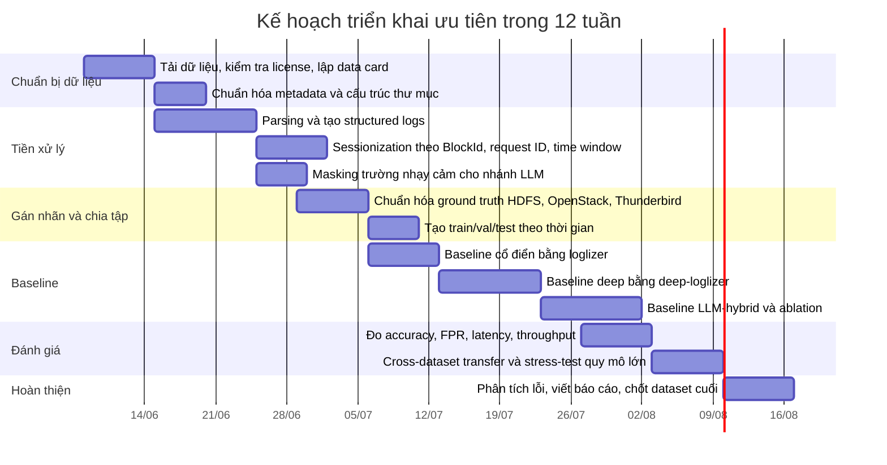

# Lựa chọn dataset cho đề tài phát hiện sự cố bất thường trên hệ thống mạng lớn bằng AI và LLM

## Tóm tắt điều hành

Đề tài của bạn tập trung vào việc xây dựng một quy trình end-to-end để thu thập, sàng lọc và phân tích **dữ liệu nhật ký hệ thống** nhằm phát hiện **sự cố bất thường** trong **hệ thống mạng lớn**, đồng thời tối ưu theo các tiêu chí **độ chính xác, tỷ lệ dương tính giả và thời gian phản hồi**, và có định hướng tích hợp **AI/LLM** vào giám sát chủ động. Nói ngắn gọn, đây là một bài toán **log anomaly detection / incident detection** thiên về **log-text có ngữ cảnh vận hành**, không phải thuần flow-based IDS hay chỉ phân tích metrics.

Vì vậy, khi chọn dữ liệu, nên ưu tiên các bộ có bốn đặc điểm: **khớp modality với log hệ thống**, **có ground truth hoặc nhãn bất thường rõ ràng**, **gần môi trường hạ tầng phân tán/cloud/network**, và **đủ lớn để đánh giá khả năng mở rộng**. Trong hệ sinh thái LogPai, nguồn dữ liệu trung tâm là **LogHub**; chính LogPai mô tả đây là bộ sưu tập lớn cho AI-driven log analytics, còn **loglizer** và **deep-loglizer** là hai toolkit chính để benchmark anomaly detection cổ điển và deep learning trên log.

Kết luận lựa chọn là: **OpenStack** là bộ khớp miền ứng dụng nhất; **HDFS_v1** là bộ tốt nhất để xây baseline ổn định, tái lập được và so sánh với literature; **Thunderbird** là bộ mạnh nhất để stress-test ở quy mô rất lớn. **HDFS_v3 TraceBench** rất đáng giá như bộ bổ trợ cho giai đoạn mở rộng sang trace-oriented monitoring; còn **CSE-CIC-IDS2018** phù hợp nếu bạn muốn thêm nhánh **multimodal security** kết hợp log với network flow.

## Trích xuất yêu cầu từ detai.md

Bảng dưới đây tổng hợp trực tiếp các yêu cầu, mục tiêu và ràng buộc được nêu trong `detai.md`. Những chỗ đánh dấu “unspecified” là những điểm tài liệu **không nêu rõ** và vì vậy cần được giả định cẩn trọng khi chọn dataset.

| Hạng mục                                       | Trích xuất từ đề tài                                                                                                 | Trạng thái             |
| ---------------------------------------------- | -------------------------------------------------------------------------------------------------------------------- | ---------------------- |
| Mục tiêu tổng quát                             | Xây dựng giải pháp phát hiện sự cố bất thường trong hệ thống mạng lớn bằng phân tích dữ liệu nhật ký hệ thống với AI | Đã nêu                 |
| Quy trình mong muốn                            | Thu thập, sàng lọc, đánh giá log; áp dụng kỹ thuật AI; phát hiện sự cố bất thường                                    | Đã nêu                 |
| Câu hỏi nghiên cứu                             | Kiến trúc xử lý log lớn; kỹ thuật AI/LLM tối ưu; tích hợp thành quy trình giám sát chủ động end-to-end               | Đã nêu                 |
| Biến đích chính                                | Trạng thái **bình thường / bất thường** hoặc **sự cố bất thường**                                                    | Nêu ngầm định          |
| Biến đích phụ                                  | Accuracy, false positive rate, response time                                                                         | Đã nêu                 |
| Modality ưu tiên                               | **Dữ liệu nhật ký hệ thống**                                                                                         | Đã nêu rõ              |
| Modality phụ trợ                               | Metrics, traces, flow, security events                                                                               | Unspecified            |
| Đơn vị dự đoán                                 | Dòng log, trace, session, host, request, incident window                                                             | Unspecified            |
| Miền ứng dụng                                  | Hệ thống mạng lớn; thử nghiệm trên hệ thống mạng quy mô vừa và nhỏ                                                   | Đã nêu                 |
| Loại sự cố                                     | Sự cố bất thường hệ thống; có liên quan đến AI-powered cyberattacks                                                  | Đã nêu ở mức khái quát |
| Taxonomy nhãn                                  | Lỗi chức năng, lỗi hiệu năng, tấn công, cấu hình sai, suy giảm dịch vụ                                               | Unspecified            |
| Công cụ thu thập                               | Có định hướng dùng công cụ giám sát mã nguồn mở                                                                      | Đã nêu                 |
| Ràng buộc dữ liệu                              | Phải xử lý khối lượng log rất lớn, đa dạng; hỗ trợ phản hồi nhanh và giảm false positive                             | Đã nêu                 |
| Ràng buộc giấy phép, thương mại hóa, phần cứng | Không thấy nêu                                                                                                       | Unspecified            |

Từ bảng trên, có thể rút ra ba yêu cầu chọn dữ liệu quan trọng nhất. Thứ nhất, **log-text** phải là modality trung tâm, vì đó là đối tượng phân tích được nêu rõ trong đề tài. Thứ hai, nên có **nhãn bất thường hoặc ít nhất là ca lỗi được kiểm soát**, để bạn đo được accuracy, false positive rate và response time một cách tin cậy. Thứ ba, bộ dữ liệu nên đủ gần với **distributed/cloud/network operations**, vì đề tài nhắm tới hệ thống mạng lớn chứ không chỉ một ứng dụng đơn lẻ.

Các điểm còn thiếu đặc tả nhưng ảnh hưởng trực tiếp tới chọn dataset là: **granularity của nhãn**, **taxonomy sự cố**, **việc traces/metrics có bắt buộc hay chỉ là bổ trợ**, **mức độ tập trung vào tấn công bảo mật so với lỗi vận hành**, và **ràng buộc thương mại/triển khai thực tế**. Vì các điểm này chưa được nêu, chiến lược an toàn nhất là chọn **một bộ sát miền**, **một bộ benchmark có nhãn mạnh**, và **một bộ rất lớn để stress-test**.

## Bản đồ nguồn dữ liệu và tiêu chí chấm điểm

Trong tổ chức GitHub **LogPai**, nguồn dữ liệu trung tâm là **LogHub**, được mô tả là “a large collection of system log datasets for AI-driven log analytics”; tổ chức này cũng duy trì **logparser** cho parsing, **loglizer** cho anomaly detection cổ điển, và **deep-loglizer** cho anomaly detection bằng deep learning. README của **loglizer** nói rõ rằng các labeled log datasets được thu thập trong **loghub**, và benchmark điển hình của loglizer được trình diễn trên HDFS; còn **deep-loglizer** liệt kê các baseline như **DeepLog/LogAnomaly/LSTM/Transformer/Autoencoder/CNN/BiLSTM**. Điều này khiến LogPai trở thành điểm xuất phát tự nhiên nhất cho đề tài của bạn.

Về dữ liệu ngoài LogPai, hai nguồn đáng xem xét là **CIC-IDS2017** và **CSE-CIC-IDS2018** của UNB/CIC. Chúng rất mạnh cho bối cảnh **network intrusion detection**, có nhãn chiến dịch tấn công rõ, và riêng **CSE-CIC-IDS2018** còn công bố cả **system logs / Windows & Ubuntu event logs** bên cạnh flow features. Tuy nhiên, trọng tâm chuẩn benchmark của chúng vẫn là **PCAP / flow CSV với hơn 80 features**, nên phù hợp hơn cho một nhánh **bổ sung security-multimodal** hơn là bộ chính cho nghiên cứu log-text.

Có một chi tiết triển khai rất quan trọng: LogHub lưu ý rằng, ở mức có thể, các log được phát hành **không được sanitize hoặc anonymize**, và giấy phép của LogHub cho phép sử dụng **cho nghiên cứu / học thuật** với điều kiện dẫn nguồn repo và paper. Điều này tốt cho realism của benchmark, nhưng cũng có nghĩa là nếu bạn dùng **LLM qua API bên ngoài**, bạn nên thêm bước **redaction/masking** hostnames, IPs, request IDs và nội dung nhạy cảm trước khi gửi prompt.

Tiêu chí chấm điểm phù hợp trong báo cáo này được thiết kế bám sát đề tài như sau. Điểm là **đánh giá tổng hợp của báo cáo**, không phải điểm do nguồn dữ liệu công bố.

| Tiêu chí                | Trọng số | Ý nghĩa đối với đề tài                                                       |
| ----------------------- | -------: | ---------------------------------------------------------------------------- |
| Khớp modality           |       35 | Ưu tiên log hệ thống; trace/flow/metrics bị trừ điểm nếu chỉ là modality phụ |
| Chất lượng ground truth |       20 | Cần đo accuracy, FPR, response time; nhãn càng rõ càng tốt                   |
| Độ gần miền ứng dụng    |       20 | Gần hệ thống mạng lớn, cloud/distributed ops tốt hơn                         |
| Quy mô và đa dạng       |       15 | Cần chịu được log volume lớn và drift của hệ thống thật                      |
| Truy cập và license     |       10 | Cần tải được, dùng được cho nghiên cứu, có nguồn chính thức                  |

Theo tiêu chí này, các bộ **không có nhãn rõ** trong LogHub như **HDFS_v2** hay **Spark** không được ưu tiên cho vòng baseline đầu tiên, dù quy mô rất lớn, vì đề tài của bạn cần kiểm soát được accuracy/FPR từ sớm.

## Hồ sơ các dataset ứng viên

Bảng so sánh nhanh dưới đây tóm tắt các ứng viên mạnh nhất. Các nguồn chi tiết và lập luận chấm điểm được trình bày ngay sau bảng.

| Dataset            | Modality chính            | Quy mô công bố                                                           | Ground truth                                                 | Môi trường                           | Điểm phù hợp | Vai trò đề xuất                               |
| ------------------ | ------------------------- | ------------------------------------------------------------------------ | ------------------------------------------------------------ | ------------------------------------ | -----------: | --------------------------------------------- |
| OpenStack          | Logs                      | 207,820 dòng; 58.61 MiB                                                  | Có normal/abnormal cases; granularity nhãn chi tiết chưa nêu | Cloud operating system trên CloudLab |           89 | Bộ sát miền nhất                              |
| HDFS_v1            | Logs                      | 11,175,629 dòng; 38.7 giờ; 1.47 GiB                                      | normal/anomaly theo block trace                              | Private cloud benchmark workloads    |           88 | Bộ baseline chuẩn nhất                        |
| Thunderbird        | Logs                      | 211,212,192 dòng; 244 ngày; 29.60 GiB                                    | alert / non-alert theo dòng                                  | Thunderbird supercomputer            |           86 | Stress-test quy mô lớn                        |
| BGL                | Logs                      | 4,747,963 dòng; 214.7 ngày; 708.76 MiB                                   | alert / non-alert theo dòng                                  | Blue Gene/L supercomputer            |           82 | Bộ lớn nhưng dễ iterate hơn Thunderbird       |
| HDFS_v3 TraceBench | Traces                    | 14,778,079 dòng; >370k traces; >180 giờ                                  | normal vs fault-injected traces; 17 faults                   | HDFS trên IaaS thật                  |           78 | Phù hợp giai đoạn mở rộng trace-oriented      |
| CSE-CIC-IDS2018    | Flow + PCAP + system logs | Hạ tầng 420 máy + 30 server; theo ngày; tổng số flow không nêu trực tiếp | Nhãn theo attack schedule / flow / machine logs              | AWS enterprise-like testbed          |           73 | Bổ trợ multimodal security                    |
| CIC-IDS2017        | Flow + PCAP               | 5 ngày; ~51.1 GB                                                         | benign vs nhiều attack classes                               | Victim/attacker network với nhiều OS |           65 | Đối chứng flow-based, không phải bộ log chính |

Các mô tả quy mô, nhãn và môi trường trong bảng được rút từ README/dataset pages chính thức của LogHub, TraceBench và UNB/CIC.

**OpenStack — 89/100.** Đây là bộ dữ liệu khớp miền ứng dụng của đề tài nhất vì OpenStack là **cloud operating system** quản lý **compute, storage và networking resources** trong datacenter; README của LogHub nêu rõ dataset này được tạo trên **CloudLab**, có cả **normal logs** và **abnormal cases with failure injection**, nên rất phù hợp cho anomaly detection ở tầng hạ tầng. Quy mô công bố là **207,820 dòng log**, dung lượng **58.61 MiB**.

Về schema, bản **structured sample CSV** do LogHub phát hành cho OpenStack dùng các field điển hình gồm `LineId`, `Logrecord`, `Date`, `Time`, `Pid`, `Level`, `Component`, `ADDR`, `Content`, `EventId`, `EventTemplate`; field `ADDR` đặc biệt hữu ích vì thường chứa request/context identifiers để correlation theo request hoặc transaction. Tuy nhiên, README chỉ nói có normal/abnormal cases chứ **không mô tả tường minh file nhãn per-line hay per-request**, nên khi dùng thực tế bạn nên coi granularity ground truth của OpenStack là **partly unspecified** và cần dựng **window/session labels** trong pipeline. License đi theo LogHub: dùng tự do cho **research/academic** với yêu cầu dẫn nguồn và cite paper.

Tiền xử lý khuyến nghị cho OpenStack là: parse raw log thành template bằng **logparser/Drain**, correlation theo `ADDR` hoặc theo service log (`nova`, `neutron`, `keystone`, nếu có), sau đó tạo **request windows** hoặc **fixed windows** để huấn luyện baseline; deep baselines có thể lấy từ deep-loglizer, còn parser/feature baselines có thể tái dùng từ logparser/loglizer. Điểm yếu chính của bộ này là **quy mô chưa thật lớn** và **chi tiết nhãn chưa chuẩn hóa công khai như HDFS_v1**, nhưng đổi lại nó cho miền ứng dụng gần đề tài nhất.

**HDFS_v1 — 88/100.** Đây là bộ tốt nhất để dựng baseline tái lập được. README chính thức mô tả HDFS_v1 là log HDFS sinh ra trong **private cloud environment** với benchmark workloads; dữ liệu được **manually labeled through handcrafted rules**, log được **sliced into traces according to block ids**, và mỗi trace theo block ID có ground truth **normal/anomaly**. Quy mô công bố là **11,175,629 dòng**, **38.7 giờ**, **1.47 GiB**.

Về schema, bản structured CSV sample của HDFS dùng các field điển hình `LineId`, `Date`, `Time`, `Pid`, `Level`, `Component`, `Content`, `EventId`, `EventTemplate`; ngoài ra bộ tiền xử lý do LogHub công bố còn có `anomaly_label.csv`, `Event_traces.csv`, `Event_occurrence_matrix.csv` và `HDFS.npz`. Trong bản demo của loglizer, HDFS được dùng trực tiếp cho API `load_HDFS(...)`, và benchmark HDFS trong loglizer công bố nhiều baseline cổ điển như LR, Decision Tree, SVM, Isolation Forest, PCA, Invariants Mining và Clustering. Điều này làm HDFS_v1 trở thành bộ lý tưởng để dựng pipeline đầu tiên, vì cả **schema**, **trace unit** lẫn **baseline literature** đều rất rõ.

Hạn chế của HDFS_v1 là ground truth được gán ở **mức block trace**, không phải incident đa dịch vụ; ngoài ra đó là hệ thống lưu trữ phân tán, nên vẫn có **domain gap** so với cloud/network orchestration thuần túy. Dù vậy, cho mục tiêu của đề tài là log anomaly detection kết hợp AI/LLM, HDFS_v1 gần như là lựa chọn baseline tốt nhất để bắt đầu và so sánh công bằng với LogPai ecosystem.

**Thunderbird — 86/100.** Thunderbird là bộ để kiểm tra khả năng mở rộng và drift dài hạn. README của LogHub mô tả đây là log từ **Thunderbird supercomputer** tại Sandia National Labs, gồm **9,024 processors** và **27,072 GB memory**; cột đầu tiên của raw log dùng dấu `-` cho **non-alert**, các giá trị khác cho **alert messages**, nên nhãn ở đây phù hợp với **alert detection / prediction**. Quy mô rất lớn: **211,212,192 dòng**, **244 ngày**, **29.60 GiB**.

Bản structured sample CSV đi kèm LogHub dùng các field `LineId`, `Label`, `Timestamp`, `Date`, `User`, `Month`, `Day`, `Time`, `Location`, `Component`, `PID`, `Content`, `EventId`, `EventTemplate`. Điều này cho phép bạn làm cả hai hướng: **event-level anomaly detection** hoặc **sequence/window-based detection** sau khi sessionize theo node/location/time. License truy cập vẫn theo LogHub, tức miễn phí cho research/academic với yêu cầu dẫn nguồn.

Điểm mạnh lớn nhất của Thunderbird là nó ép pipeline của bạn đối mặt với đúng vấn đề mà đề tài nhấn mạnh: **khối lượng log khổng lồ** và **log drift theo thời gian dài**. Điểm yếu là nhãn kiểu **alert / non-alert** không giàu ngữ nghĩa bằng nhãn sự cố theo request/trace, và bối cảnh **HPC** không trùng hẳn với hạ tầng mạng/cloud. Vì vậy Thunderbird rất hợp cho giai đoạn **stress-test và đánh giá FPR ở quy mô lớn**, nhưng không nên là bộ duy nhất.

**BGL — 82/100.** BGL cũng là bộ HPC có alert tags, nhưng nhẹ hơn Thunderbird nên dễ iterate hơn. README LogHub cho biết đây là log từ **Blue Gene/L supercomputer** tại Lawrence Livermore National Labs với **131,072 processors** và **32,768 GB memory**; tương tự Thunderbird, ký hiệu `-` là non-alert, các giá trị khác là alert messages, nên thích hợp cho alert detection và failure prediction. Quy mô công bố là **4,747,963 dòng** trong **214.7 ngày**, tổng **708.76 MiB**.

Bản structured sample CSV của BGL có schema điển hình `LineId`, `Label`, `Timestamp`, `Date`, `Node`, `Time`, `NodeRepeat`, `Type`, `Component`, `Level`, `Content`, `EventId`, `EventTemplate`. Nếu máy yếu hơn hoặc bạn cần vòng lặp thí nghiệm nhanh hơn Thunderbird, BGL là lựa chọn hợp lý để phát triển mô hình event/window-based trước khi scale lên Thunderbird. Hạn chế của BGL giống Thunderbird: nhãn là alert-level hơn là incident-level, và miền HPC vẫn lệch so với network/cloud ops.

**HDFS_v3 TraceBench — 78/100.** Đây là bộ rất đáng giá nếu bạn muốn vượt khỏi log-text sang **trace-oriented monitoring**. Theo README HDFS trong LogHub, **HDFS_v3_TraceBench** là dữ liệu traces thu thập bằng **MTracer** trên HDFS chạy trong môi trường **IaaS thật**, có nhiều kịch bản cluster scales, request types, workload speeds, và cả **normal** lẫn **fault-injected** cases. LogHub công bố quy mô **14,778,079 dòng** và **2.96 GiB**; trang TraceBench mô tả thêm rằng bộ dữ liệu kéo dài **hơn 180 giờ**, gồm **364 files** với **hơn 370,000 traces**.

Điểm rất mạnh của TraceBench là schema được mô tả cực rõ ở trang chính thức. Các trace được lưu bằng **Event** và **Edge**; bảng Event có `TraceID`, `NID`, `OpName`, `StartTime`, `EndTime`, `HostAddress`, `HostName`, `Agent`, `Description`; ngoài ra còn có các bảng `Trace` và `Operation` thống kê số events, số edges và latency. Quan trọng hơn, bộ này có **17 fault types** trên nhiều nhóm như process, network, data, system và bug thực, với môi trường gồm **50 datanodes, 1 namenode, 50 clients** trên IaaS/CloudStack.

Với đề tài của bạn, TraceBench không phải bộ chính vì modality trung tâm là **trace**, không phải raw textual system logs. Nhưng nó cực kỳ hữu ích cho **giai đoạn hai**: kiểm định xem kỹ thuật AI/LLM của bạn có mở rộng được sang correlation theo **causal path / latency / operation graph** hay không. Đây là bộ nên dùng nếu bạn muốn nói về **proactive monitoring** ở mức cao hơn anomaly-on-text. Về license/truy cập, trang TraceBench nói rõ bộ dữ liệu **freely available**, còn bản phát hành qua LogHub vẫn chịu điều kiện cite nguồn/paper cho research.

**CSE-CIC-IDS2018 — 73/100.** Đây là ứng viên ngoài LogPai phù hợp nhất nếu bạn muốn thêm nhánh **security-centered multimodal anomaly detection**. Trang chính thức của UNB/CIC mô tả đây là dự án hợp tác giữa **CSE** và **CIC**, với **7 attack scenarios** gồm brute-force, Heartbleed, botnet, DoS, DDoS, web attacks và infiltration. Hạ tầng tấn công có **50 machines**, còn tổ chức nạn nhân có **5 departments**, **420 machines** và **30 servers**; quan trọng là bộ này bao gồm **captured network traffic** và **system logs of each machine**, đồng thời phát hành **hơn 80 traffic features** từ CICFlowMeter-V3.

Nhãn trong CSE-CIC-IDS2018 chủ yếu là **per-flow labels** từ CICFlowMeter, còn system logs thì được gán theo **kế hoạch tấn công** (attack schedule), ví dụ như ngày X-Y là thời gian của attack Z. Về schema, flow-level data có `Timestamp`, `Duration`, `Protocol`, `Source IP`, `Source Port`, `Destination IP`, `Destination Port`, `Flow Bytes/s` và rất nhiều features khác. Log riêng của mỗi node thì theo format Linux/Windows thông thường, nhưng không có unified public parser hay template.

Với đề tài của bạn, CSE-CIC-IDS2018 có thể dùng cho nhánh **security-focused anomaly detection**. Điểm mạnh là có cả flow + logs + nhiều attack types, nên bạn có thể thí nghiệm **multimodal detection** (ví dụ: LLM tóm tắt log, sau đó dùng vector similarity với features của flow để đánh giá độ tin cậy). Điểm yếu lớn nhất là **không phải dạng log-only**, có nghĩa là yêu cầu preprocessing lớn để align log và network data; đồng thời annotation chỉ theo **kế hoạch tấn công** chứ không phải per-event incident labels như HDFS/OpenStack, nên cần rất cẩn thận khi định nghĩa ground truth. Về license/truy cập: dự án có bài báo khoa học và cho phép dùng **for research purposes**.

Về schema, phần CSV flow có các cột nền là `FlowID`, `SourceIP`, `DestinationIP`, `SourcePort`, `DestinationPort`, `Protocol` cùng hơn 80 features; nhãn được gán theo **attack schedule**, **IPs/ports**, **protocol** và **attack type**. Về truy cập, dữ liệu được tổ chức **per day**, raw data gồm **PCAP + event logs per machine**, còn CSV features lưu **per machine**; license cho phép **redistribute/republish/mirror** nếu dẫn nguồn dataset và trang AWS open data.

Điểm mạnh của CSE-CIC-IDS2018 là rất gần mục tiêu “phòng thủ trước các cuộc tấn công mạng” trong đề tài. Nhưng điểm yếu là benchmark phổ biến của nó thiên về **network-flow features**, không phải **log-text semantics**; muốn dùng đúng tinh thần đề tài, bạn sẽ phải làm thêm bước đồng bộ **machine logs** với attack windows, hoặc dùng nó như một **bộ bổ trợ** để kiểm tra liệu mô hình log của bạn có thể nâng cấp thành **log + flow fusion** hay không. Vì vậy, đây là bộ rất hay nhưng không nên là bộ chính của vòng thí nghiệm đầu tiên.

**CIC-IDS2017 — 65/100.** Đây là bộ network-centric kinh điển, phù hợp hơn cho đối chứng với NIDS hơn là bộ log chính. Theo trang chính thức, CIC-IDS2017 kéo dài **5 ngày** từ **3/7/2017 đến 7/7/2017**, bao gồm benign traffic và nhiều tấn công như brute force, DoS, DDoS, Heartbleed, Web Attack, Infiltration và Botnet. Dataset phát hành **PCAP**, **labeled flows** và CSV cho machine/deep learning; trang chính thức cũng liệt kê quy mô theo ngày là **11.0G, 11G, 13G, 7.8G, 8.3G**, tương đương khoảng **51.1 GB**.

Schema flow của CIC-IDS2017 dựa trên CICFlowMeter với **hơn 80 network flow features**, và nhãn flow được gắn theo thời gian, source/destination IP/ports, protocol và attack class. Môi trường có **12 victim machines**, nhiều hệ điều hành Windows/Ubuntu/Mac, cùng attack network riêng. License chính thức nói rõ dữ liệu được **publicly available for researchers**, kèm yêu cầu cite paper liên quan.

Tuy hữu ích nếu bạn muốn có một **đường so sánh với network IDS**, CIC-IDS2017 không phải lựa chọn đầu bảng cho đề tài của bạn vì thiếu trọng tâm vào **system log text**. Nếu dùng, nên dùng như bộ **đối chứng phụ** để trả lời câu hỏi “mô hình chỉ dùng log có thua/sánh thế nào so với đặc trưng flow truyền thống trong kịch bản an ninh mạng?”.

## Khuyến nghị dataset và kế hoạch triển khai

Khuyến nghị thực tế nhất là chọn **ba bộ dữ liệu theo vai trò**, thay vì cố tìm một bộ duy nhất làm mọi việc. Bộ **thứ nhất** nên là **OpenStack** vì nó gần nhất với bài toán **hạ tầng mạng/cloud** và có cả normal/abnormal cases. Bộ **thứ hai** nên là **HDFS_v1** để xây pipeline baseline chuẩn, dễ tái lập và dễ so với literature/LogPai toolkit. Bộ **thứ ba** nên là **Thunderbird** để kiểm tra độ bền, drift và false positive ở quy mô rất lớn. Nếu tài nguyên tính toán hạn chế, có thể thay Thunderbird bằng **BGL** trong giai đoạn phát triển, rồi mới nâng lên Thunderbird ở giai đoạn cuối.

Bảng quyết định ưu tiên có thể chốt như sau.

| Ưu tiên  | Dataset            | Vai trò                     | Lý do chính                                                      |
| -------- | ------------------ | --------------------------- | ---------------------------------------------------------------- |
| Cao nhất | OpenStack          | Dataset miền đích           | Gần hạ tầng cloud/network nhất; có ca lỗi được tiêm; log-centric |
| Cao      | HDFS_v1            | Baseline benchmark          | Nhãn mạnh, trace rõ, có sẵn baseline trong LogPai ecosystem      |
| Cao vừa  | Thunderbird        | Stress-test quy mô lớn      | 211M dòng, 244 ngày, tốt cho FPR và drift                        |
| Tùy chọn | HDFS_v3 TraceBench | Mở rộng trace-oriented      | Có 17 faults, >370k traces, tốt cho proactive monitoring         |
| Tùy chọn | CSE-CIC-IDS2018    | Mở rộng security-multimodal | Có cả system logs và flow features, gần cyberattack scenarios    |

Về acquisition, nên tải toàn bộ từ nguồn chính thức và lập **data card** cho từng bộ ngay từ đầu, gồm phiên bản, license, số file, checksum, dung lượng, field mapping và cách dẫn nguồn. Với LogHub, README cho biết raw logs tải qua hyperlink ở cột Download, và license yêu cầu dẫn repo/paper; với CSE-CIC-IDS2018, trang chính thức dùng AWS open data / S3.

Về preprocessing, pipeline nên thống nhất theo ba tầng. Tầng đầu là **parsing**: dùng **logparser** hoặc **Drain/Drain3** để chuyển log thô thành template và structured fields. Tầng hai là **sessionization / correlation**: HDFS_v1 group theo **BlockId**; OpenStack group theo **request/context IDs** hoặc service-log windows; Thunderbird/BGL group theo **node/location/time window**. Tầng ba là **featureing**: song song tạo (a) histogram/Event occurrence matrix cho baseline cổ điển theo loglizer, (b) sequence tensors cho DeepLog/Transformer theo deep-loglizer, và (c) context snippets ngắn gọn cho nhánh LLM.

Về labeling, HDFS_v1, BGL, Thunderbird đã có ground truth tương đối rõ theo đúng kiểu benchmark của chúng. Với OpenStack, do README không mô tả nhãn chi tiết ở mức dòng/request, nên bạn nên chuẩn hóa nhãn theo **case**, rồi dựng các **window labels** nhất quán cho benchmarking. Với dữ liệu riêng của dự án sau này, nên áp dụng chiến lược **weak supervision**: ghép ticket/alert/incident timeline, rule-based heuristics, rồi mới dùng LLM để **triage và giải thích**, không dùng LLM làm nhãn vàng duy nhất.

Về baseline experiments, nên chạy theo ba lớp. Lớp đầu là **classical log anomaly detection** với PCA, Isolation Forest, Invariants Mining, Clustering và một supervised baseline đơn giản trên HDFS_v1/OpenStack. Lớp hai là **sequential deep models** như DeepLog, LogAnomaly, LSTM, Transformer và Autoencoder. Lớp ba là **LLM-hybrid**: không feed toàn bộ raw log trực tiếp, mà feed **template sequence + key fields + retrieval context**, rồi đo xem LLM có giúp giảm false positives hay cải thiện explanation/triage hay không. Đây là cách hợp lý hơn nhiều so với dùng raw log trực tiếp khi đề tài đồng thời quan tâm tới **response time**.

Một khuyến nghị rất thực dụng là chia evaluation thành hai câu hỏi riêng. Câu hỏi một: **phát hiện bất thường có chính xác không?** — đo bằng Precision, Recall, F1, ROC-AUC hoặc PR-AUC, đặc biệt là **false positive rate**. Câu hỏi hai: **giải pháp có vận hành được không?** — đo bằng **thời gian parsing**, **thời gian inference**, throughput theo dòng log/giây, và footprint bộ nhớ trên bộ Thunderbird/BGL lớn. Như vậy bạn sẽ bám sát đúng tiêu chí đề tài thay vì chỉ tối ưu một chỉ số học máy.

Nếu cần một kế hoạch ngắn gọn hơn để bắt tay ngay, thứ tự nên là: **OpenStack trước**, **HDFS_v1 song song**, rồi **Thunderbird/BGL** sau cùng. OpenStack giúp bạn chứng minh phù hợp miền ứng dụng; HDFS_v1 giúp bạn có kết quả benchmark sớm và sạch; Thunderbird/BGL giúp bạn trả lời câu hỏi về quy mô, drift và false positives; HDFS_v3 hoặc CSE-CIC-IDS2018 chỉ nên thêm vào khi hai bộ đầu đã ổn.

## Kết luận

Nếu mục tiêu là chọn bộ dữ liệu **phù hợp nhất cho đúng đề tài hiện tại**, lựa chọn tốt nhất không phải là “bộ lớn nhất” hay “bộ nổi tiếng nhất”, mà là **bộ khớp đúng modality và đúng câu hỏi nghiên cứu**. Theo tiêu chí đó, **OpenStack** là lựa chọn số một cho miền ứng dụng; **HDFS_v1** là lựa chọn số một cho baseline và tái lập; còn **Thunderbird** là lựa chọn số một cho kiểm định quy mô lớn. **HDFS_v3 TraceBench** nên được dùng để mở rộng sang proactive/trace-oriented monitoring; **CSE-CIC-IDS2018** chỉ nên được thêm khi bạn muốn chứng minh khả năng mở rộng sang security-multimodal ngoài log-text.

Tóm lại, bộ ba nên chốt cho vòng đầu là **OpenStack + HDFS_v1 + Thunderbird**. Nếu buộc phải bắt đầu chỉ với hai bộ, hãy chọn **OpenStack + HDFS_v1**. Nếu tài nguyên hạn chế, dùng **BGL** thay cho Thunderbird trong giai đoạn phát triển nhanh. Cách chọn này bám sát nhất với mục tiêu, mô thức dữ liệu và ràng buộc đánh giá mà `detai.md` đặt ra.
